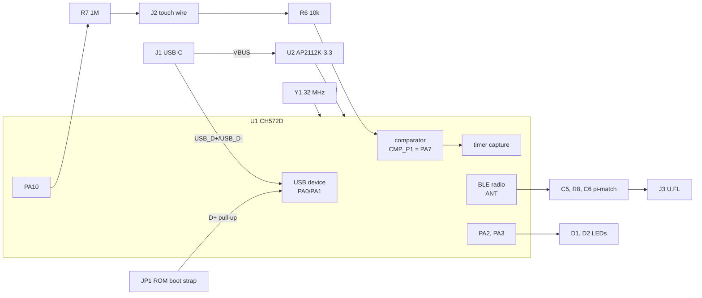

# Architecture

## Board

```mermaid
flowchart LR
    usb[J1 USB-C]
    ldo[U2 AP2112K-3.3]
    subgraph mcu[U1 CH572D]
        cmp[comparator<br/>CMP_P1 = PA7]
        tmr[timer capture]
        gpio[PA10]
        ble[BLE radio<br/>ANT]
        usbd[USB device<br/>PA0/PA1]
        leds[PA2, PA3]
    end
    y1[Y1 32 MHz]
    wire[J2 touch wire]
    r7[R7 1M]
    r6[R6 10k]
    match[C5, R8, C6 pi-match]
    ant[J3 U.FL]
    d[D1, D2 LEDs]
    jp1[JP1 ROM boot strap]

    usb -- VBUS --> ldo -- +3V3 --> mcu
    usb -- USB_D+/USB_D- --> usbd
    jp1 -- D+ pull-up --> usbd
    y1 --> mcu
    gpio --> r7 --> wire
    wire --> r6 --> cmp --> tmr
    ble --> match --> ant
    leds --> d
```

## One touch measurement, in order

Durations show order only, not time; the charge step is the measured one
(about 2.8 us at 10 pF, see [NOTES.md](NOTES.md)).

```mermaid
gantt
    dateFormat X
    axisFormat %s
    section PA10
    Low: discharge the wire through R7 :d1, 0, 5
    High: charge the wire through R7   :d2, after d1, 3
    section Comparator on PA7
    Below the reference                :c1, 0, 6
    Crosses the reference, output high :c2, after c1, 2
    section Timer
    Start at the PA10 rising edge      :t1, after d1, 1
    Capture on the comparator output   :t2, after c1, 1
```
